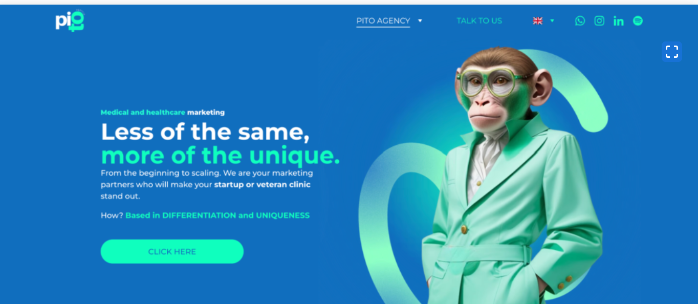
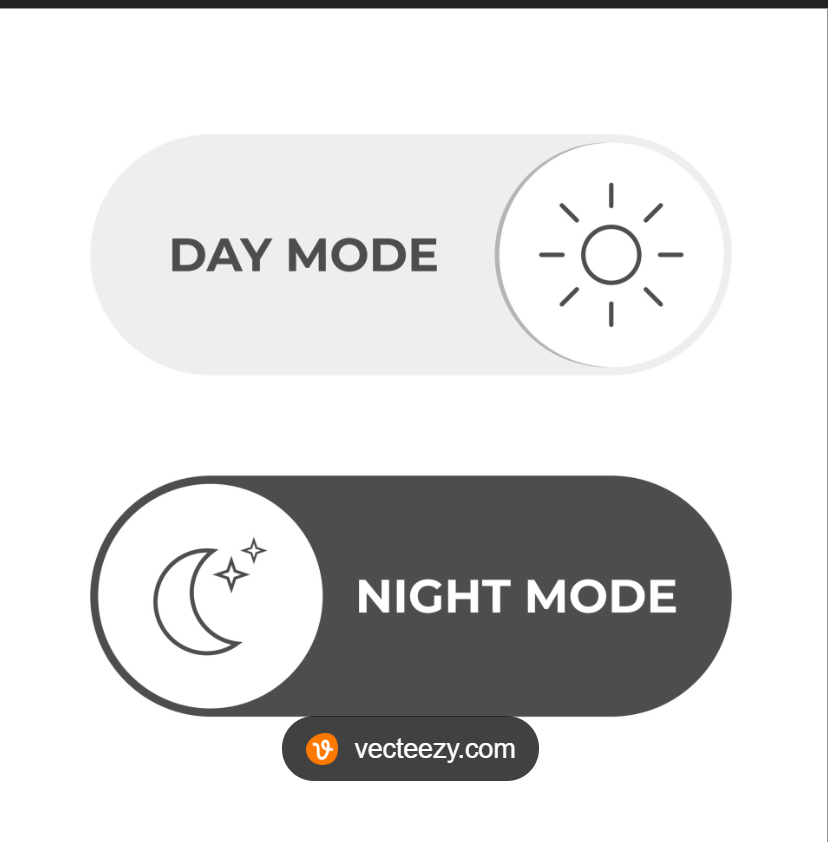

# Create static portfolio website using claude

# Requirements

- It should be compatible to be published on github pages
- It contains the sections: About, Experience, education, skills, Projects, interests, certifications
- Create a left section which is static and contains the following:
  - Name
  - Title
  - Photo
  - Social links
  - Resume link
  - Theme toggle button
  - left section content should be centered vertically and all content should be visible on the screen without scrolling
- add an option to switch between dark and light mode
- It should be responsive to different screen sizes
- experience section should display three points for each job and has the option to expand to show all the points.
- skills section animation should be triggered when the user scrolls to the skills section
- default theme should be dark
- About me section details should fill the complete width of the page
- It should be easy to navigate
- It should be easy to update
- It should be easy to maintain
- It should be easy to customize
- It should be easy to deploy
- It should be easy to test
- It should be easy to debug
- It should be easy to secure
- It should be easy to scale
- It should be easy to maintain
- It should be easy to customize
- It should be easy to deploy
- It should be easy to test
- It should be easy to debug
- It should be easy to secure
- It should be easy to scale

# Design

- take inspiration from (https://github.com/codebucks27/Next.js-Developer-Portfolio-Starter-Code)
- use this image as a reference for the color schemes 
- use the image as a reference for the theme toggle button 
- It should be modern and professional
- It should be visually appealing
- It should be easy to navigate
- It should be easy to update
- It should be easy to maintain
- It should be easy to customize
- It should be easy to deploy
- It should be easy to test
- It should be easy to debug
- It should be easy to secure
- It should be easy to scale

# project structure

- Create js folder and put all the js files in it
- Create css folder and put all the css files in it
- Create images folder and put all the images in it
- Create index.html file in the root folder
